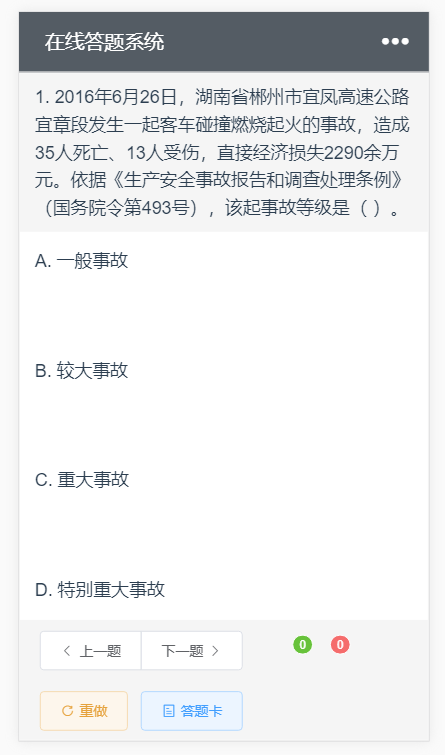
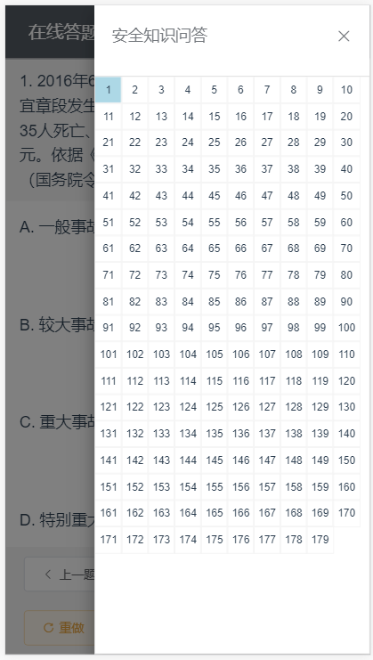

# exercises

> 在线做题网站，Vue框架+Vuex状态管理

[后端仓库地址](https://github.com/1446445040/onlineExercisesServer)

[预览](http://app.biubiubius.com:8081)

## 截图




## 起步

``` bash
# 安装依赖
npm install

# 运行服务，端口可在config目录下index.js文件配置
npm run dev

```

### 可能的问题
运行过程中如果发现请求错误，请大家自行修改一下请求地址，位置如下：

 ```/src/api/api.js```
