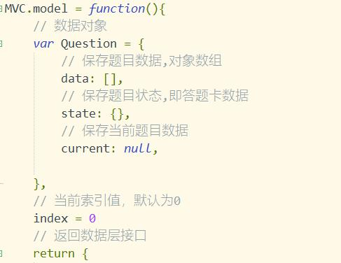
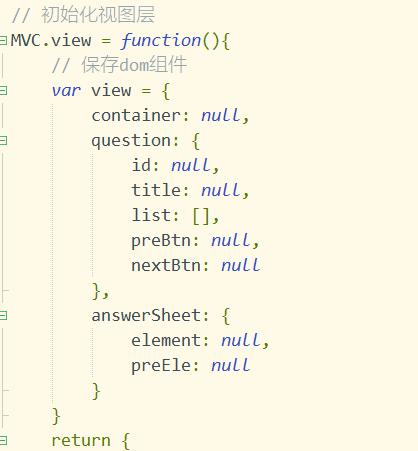
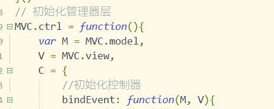

# onlineExercises
将本地题库(excel表格)内的题目加载到网页中，类似刷题软件一样做题，题库题目需要符合一定的格式

## 写在前面
这个小项目是我在学习完**JavaScript设计模式**这本书之后的一个小小的实践，果然知识还是需要实践才能更好地掌握。

目前只支持选择题的部署，而且题库中的题目必须符合格式（题号，题目，四个选项，正确答案）。只要符合这个格式应该是可以兼容的。题目或者选项过长可能会引起布局溢出

## 设计模式
是按照MVP模式组合的，M和V主要是控制视图和数据，然后在P里面引用前两块，将M和V组合起来。但是
水平有限，部分地方还是存在一些耦合（在处理视图事件绑定的地方），但是我已经尽量让数据和视图解耦了。

## JS目录
### main.js
负责读取表格数据并将数据传递到MVP架构中
### question.js
项目核心文件，使用的是MVP的模式，但是我还是用的MVC来命名的。MVC.model是数据模块，MVC.view是视图模块，MVC.ctrl是控制器模块

